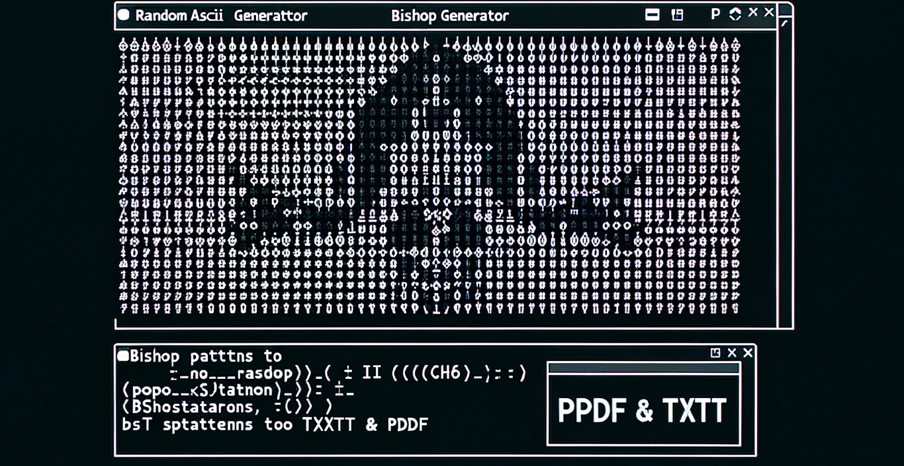
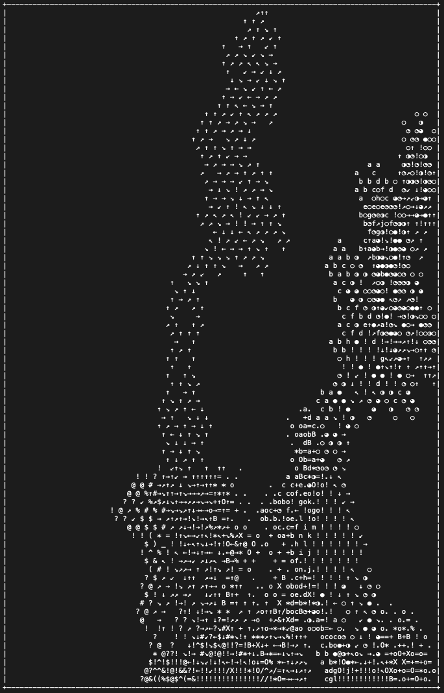

# Random ASCII Art Pattern Generator

## Description

This Python script generates random ASCII art patterns using multiple bishops with various customization options. It produces both text and PDF outputs with the ASCII patterns. The core algorithm of this project is based on the "drunken-bishop" algorithm for visualizing SSH key fingerprints in OpenSSH. 

While this project was inspired by and includes modified code from Manfred Touron's implementation of the "drunken-bishop" algorithm, the original concept of the algorithm is attributed to Alexander von Gernler.

## Features

- Customizable number of bishops
- Optional use of different alphabets for different bishops
- Output in `.txt` and `.pdf` formats

## Dependencies

- `os`
- `random`
- `argparse`
- `unicodedata`
- `PIL`
- `pandas`
- `reportlab`

You can install the required third-party packages using pip:

```bash
pip install -r requirements.txt
```

## About the Drunken Bishop Algorithm

The "drunken-bishop" algorithm, initially devised for visualizing SSH key fingerprints in OpenSSH, represents a sophisticated approach to rendering complex data into an accessible, visual format. This algorithm emerged not merely as a whimsical method, but as a robust means to depict the inherent randomness and uniqueness of SSH keys.

In this context, the Random ASCII Art Pattern Generator repurposes the "drunken-bishop" algorithm.
Here, the algorithm is no longer a tool for security visualization, but an instrument for generating distinctive ASCII patterns. The core principle of the algorithm is its stochastic movement, reminiscent of a bishop's diagonal strides in chess. This movement, dictated by the input data, ensures that each execution yields a unique, non-repetitive pattern.

The algorithm's elegance is in its fusion of simplicity and complexity, order and chaos. It demonstrates how algorithmic processes can transcend their original utilitarian purposes to inspire creative expression.

## Installation with Virtual Environment

To ensure a clean and isolated environment for running the script, it's recommended to use a virtual environment. Here's how you can set it up:

1. **Create a Virtual Environment:**
   
   ```bash
   python -m venv venv
   ```
   
   This command creates a new virtual environment named `venv` in your current directory.

2. **Activate the Virtual Environment:**
   
   - On Windows:
     
     ```bash
     .\venv\Scripts\activate
     ```
   
   - On macOS and Linux:
     
     ```bash
     source venv/bin/activate
     ```
     
     This step activates the virtual environment. You'll notice `(venv)` appears before your command prompt when it's active.

3. **Install Dependencies:**
   While the virtual environment is active, install the required packages:
   
   ```bash
   pip install -r requirements.txt
   ```
   
   This ensures all dependencies are installed within the `venv` and not globally.

4. **Running the Script:**
   You can now run the script as mentioned in the Usage section.

5. **Deactivating the Virtual Environment:**
   Once you're done, you can deactivate the virtual environment by typing:
   
   ```bash
   deactivate
   ```

## Usage

### Basic Usage

To run the script with default settings:

```bash
python drunken_bishop.py
```

## Example output

#### drunken:



#### sober:


#### text output:

```bash
+----------------------------------------------------------------------------------------------------+
|!!!!⎨ ⎠⎤⎠⎫⎤⎧⎨⎠ ⎝⎠⎛⎡⎞⎠⎠⎞⎛⎛⎞⎞⎛⎛       ⎛⎠⎛⎡⎛⎞⎠ ⎠⎞⎛ ⎛⎛⎛⎛ ⎛⎞⎠ ⎠⎞⎛⎡⎛⎠⎛       ⎛⎛⎞⎞⎛⎛⎞⎠⎠⎞⎡⎛⎠⎝ ⎠⎨⎧⎤⎫⎠⎤⎠ ⎨!!!!|
|!⎧⎫!⎬⎡⎧⎠⎬ ⎨⎨⎤⎠⎡⎡⎞⎝ ⎝⎠⎞⎛⎛⎛⎛⎛⎛⎞   ⎛  ⎛⎠⎛⎨⎛⎬⎞ ⎨⎛⎠   ⎝⎝   ⎠⎛⎨ ⎞⎬⎛⎨⎛⎠⎛  ⎛   ⎞⎛⎛⎛⎛⎛⎛⎞⎠⎝ ⎝⎞⎡⎡⎠⎤⎨⎨ ⎬⎠⎧⎡⎬!⎫⎧!|
|⎨⎤⎧⎞⎧⎝⎬⎬⎞⎝⎧⎝⎛⎤⎞⎠⎝⎛⎞⎡⎠⎛ ⎛⎛⎛ ⎛ ⎞ ⎛ ⎛⎞ ⎛⎨ ⎧⎠⎞⎞⎞⎨ ⎛ ⎞⎞⎞⎞ ⎛ ⎨⎞⎞⎞⎠⎧ ⎨⎛ ⎞⎛ ⎛ ⎞ ⎛ ⎛⎛⎛ ⎛⎠⎡⎞⎛⎝⎠⎞⎤⎛⎝⎧⎝⎞⎬⎬⎝⎧⎞⎧⎤⎨|
|⎤⎝ ⎨⎝⎧⎝⎠ ⎧⎡⎤⎠⎞⎝⎞⎛ ⎡⎠⎠⎛⎛⎛⎛     ⎞  ⎞⎛⎛⎞ ⎡⎛⎨ ⎤⎠ ⎤ ⎛⎞⎠⎠⎞⎛ ⎤ ⎠⎤ ⎨⎛⎡ ⎞⎛⎛⎞  ⎞     ⎛⎛⎛⎛⎠⎠⎡ ⎛⎞⎝⎞⎠⎤⎡⎧ ⎠⎝⎧⎝⎨ ⎝⎤|
|⎡ ⎝⎝⎛⎝!⎝⎤⎡⎧⎞⎞ ⎠⎡⎠⎠⎞⎡⎠ ⎠         ⎞  ⎞ ⎞ ⎠ ⎤⎛⎛⎞⎞⎡⎝⎞⎝⎝⎞⎝⎡⎞⎞⎛⎛⎤ ⎠ ⎞ ⎞  ⎞         ⎠ ⎠⎡⎞⎠⎠⎡⎠ ⎞⎞⎧⎡⎤⎝!⎝⎛⎝⎝ ⎡|
|⎡⎝ ⎞⎞⎠⎞⎧⎠⎬⎝⎬ ⎛⎛⎡⎡⎛⎝⎡⎝⎠ ⎛       ⎛    ⎞ ⎞ ⎝⎛ ⎛⎠ ⎛⎝⎝⎠⎠⎝⎝⎛ ⎠⎛ ⎛⎝ ⎞ ⎞    ⎛       ⎛ ⎠⎝⎡⎝⎛⎡⎡⎛⎛ ⎬⎝⎬⎠⎧⎞⎠⎞⎞ ⎝⎡|
|⎬⎛⎝   ⎛ ⎫⎛⎤ ⎞ ⎞ ⎞⎝⎛⎠⎝⎛⎞             ⎛⎞ ⎠⎠⎛⎠⎞ ⎞⎛⎛⎝⎞⎞⎝⎛⎛⎞ ⎞⎠⎛⎠⎠ ⎞⎛             ⎞⎛⎝⎠⎛⎝⎞ ⎞ ⎞ ⎤⎛⎫ ⎛   ⎝⎛⎬|
|⎝⎡ ⎛ ⎛ ⎞ ⎞ ⎞ ⎛ ⎠  ⎛⎡⎛⎝ ⎛           ⎞   ⎠⎞⎝⎞⎠⎝  ⎝⎛⎞⎞⎛⎝  ⎝⎠⎞⎝⎞⎠   ⎞           ⎛ ⎝⎛⎡⎛  ⎠ ⎛ ⎞ ⎞ ⎞ ⎛ ⎛ ⎡⎝|
|⎨   ⎞ ⎛   ⎞ ⎠ ⎠ ⎛ ⎠ ⎤ ⎠ ⎛           ⎠ ⎨⎞⎠ ⎠⎠⎠⎞⎛ ⎞⎛⎛⎞ ⎛⎞⎠⎠⎠ ⎠⎞⎨ ⎠           ⎛ ⎠ ⎤ ⎠ ⎛ ⎠ ⎠ ⎞   ⎛ ⎞   ⎨|
|⎝⎠ ⎞ ⎞   ⎠ ⎛ ⎠ ⎝ ⎛ ⎝ ⎨ ⎝ ⎤ ⎞       ⎛ ⎧⎞⎬⎛⎞⎛⎡⎛⎞ ⎛ ⎞⎞ ⎛ ⎞⎛⎡⎛⎞⎛⎬⎞⎧ ⎛       ⎞ ⎤ ⎝ ⎨ ⎝ ⎛ ⎝ ⎠ ⎛ ⎠   ⎞ ⎞ ⎠⎝|
|⎡⎛⎠ ⎞ ⎞ ⎠ ⎞ ⎛ ⎞ ⎝ ⎠ ⎨ ⎤ ! ⎤ ⎝       ⎨⎝⎨⎛⎡ ⎡⎛⎞ ⎞⎞⎛⎛⎛⎛⎞⎞ ⎞⎛⎡ ⎡⎛⎨⎝⎨       ⎝ ⎤ ! ⎤ ⎨ ⎠ ⎝ ⎞ ⎛ ⎞ ⎠ ⎞ ⎞ ⎠⎛⎡|
|⎞⎞ ⎛ ⎞ ⎝ ⎠   ⎠ ⎠ ⎡ ⎨ ⎬ ⎤ ! ⎡ ⎠     ⎠⎞⎡⎞⎝ ⎡⎞⎠ ⎞⎛⎞⎠  ⎠⎞⎛⎞ ⎠⎞⎡ ⎝⎞⎡⎞⎠     ⎠ ⎡ ! ⎤ ⎬ ⎨ ⎡ ⎠ ⎠   ⎠ ⎝ ⎞ ⎛ ⎞⎞|
|⎞   ⎞ ⎛ ⎞ ⎠ ⎝ ⎡ ⎝ ⎤ ⎨ ⎨ ⎬ ! ⎤ ⎞     ⎡⎛⎫ ⎠⎛⎞⎛⎛ ⎠⎛⎛⎛⎛⎛⎛⎠ ⎛⎛⎞⎛⎠ ⎫⎛⎡     ⎞ ⎤ ! ⎬ ⎨ ⎨ ⎤ ⎝ ⎡ ⎝ ⎠ ⎞ ⎛ ⎞   ⎞|
| ⎞ ⎞ ⎞   ⎝ ⎛ ⎝ ⎡ ⎡ ⎠ ⎧ ⎤ ! ! ⎞ ⎞   ⎞⎞⎨ ⎨⎛⎠ ⎠ ⎞ ⎞ ⎛⎛ ⎞ ⎞ ⎠ ⎠⎛⎨ ⎨⎞⎞   ⎞ ⎞ ! ! ⎤ ⎧ ⎠ ⎡ ⎡ ⎝ ⎛ ⎝   ⎞ ⎞ ⎞ |
|  ⎞ ⎞ ⎛ ⎞ ⎞ ⎠ ⎠ ⎡ ⎝ ⎡ ! ! ! !   ⎞ ⎞ ⎡⎞⎡⎛⎤ ⎤ ⎝ ⎞ ⎞⎞⎞⎞ ⎞ ⎝ ⎤ ⎤⎛⎡⎞⎡ ⎞ ⎞   ! ! ! ! ⎡ ⎝ ⎡ ⎠ ⎠ ⎞ ⎞ ⎛ ⎞ ⎞  |
|     ⎛ ⎞ ⎠ ⎛ ⎡ ⎞ ⎨ ⎝ ⎨ ! ! ! ⎤   ⎞ ⎡⎛⎠ ⎡⎛⎝ ⎡ ⎡ ⎠⎛⎠⎠⎛⎠ ⎡ ⎡ ⎝⎛⎡ ⎠⎛⎡ ⎞   ⎤ ! ! ! ⎨ ⎝ ⎨ ⎞ ⎡ ⎛ ⎠ ⎞ ⎛     |
|        ⎞ ⎛ ⎞ ⎝ ⎡ ⎤ ⎝ ⎨ ! ! ! ⎞   ⎛ ⎛⎛⎛⎞⎞ ⎠ ⎠ ⎞ ⎠  ⎠ ⎞ ⎠ ⎠ ⎞⎞⎛⎛⎛ ⎛   ⎞ ! ! ! ⎨ ⎝ ⎤ ⎡ ⎝ ⎞ ⎛ ⎞        |
|         ⎛   ⎛ ⎤ ⎤ ⎝ ⎫ ⎡ ! ! ⎝ ⎞    ⎛ ⎞ ⎞⎛     ⎞    ⎞     ⎛⎞ ⎞ ⎛    ⎞ ⎝ ! ! ⎡ ⎫ ⎝ ⎤ ⎤ ⎛   ⎛         |
|            ⎞ ⎡ ⎡ ⎝ ⎨ ! ! ! ! ⎞ ⎞  ⎞ ⎞ ⎛ ⎛      ⎛  ⎛      ⎛ ⎛ ⎞ ⎞  ⎞ ⎞ ! ! ! ! ⎨ ⎝ ⎡ ⎡ ⎞            |
|           ⎛ ⎝ ⎡ ⎡ ⎬ ⎫ ! ! ⎫ ⎬ ⎛ ⎛  ⎞ ⎛ ⎛                  ⎛ ⎛ ⎞  ⎛ ⎛ ⎬ ⎫ ! ! ⎫ ⎬ ⎡ ⎡ ⎝ ⎛           |
|            ⎛ ⎛ ⎝ ⎡ ⎝ ⎤ ⎬ ! ⎤ ⎛        ⎛                    ⎛        ⎛ ⎤ ! ⎬ ⎤ ⎝ ⎡ ⎝ ⎛ ⎛            |
|       ⎞       ⎛ ⎝ ⎞ ⎝ ⎝ ⎫ ! ⎞                                        ⎞ ! ⎫ ⎝ ⎝ ⎞ ⎝ ⎛       ⎞       |
|      ⎞ ⎛     ⎞ ⎠ ⎞ ⎡ ⎬ ⎨ ⎨ ⎨ ⎞                                      ⎞ ⎨ ⎨ ⎨ ⎬ ⎡ ⎞ ⎠ ⎞     ⎛ ⎞      |
|     ⎛ ⎛     ⎛ ⎠ ⎠ ⎤ ⎨ ⎡ ⎨ ⎝ ⎡ ⎛                                    ⎛ ⎡ ⎝ ⎨ ⎡ ⎨ ⎤ ⎠ ⎠ ⎛     ⎛ ⎛     |
|    ⎠ ⎛         ⎠ ⎞ ⎠ ⎝ ⎝ ⎠ ⎠ ⎛                                      ⎛ ⎠ ⎠ ⎝ ⎝ ⎠ ⎞ ⎠         ⎛ ⎠    |
|   ⎠ ⎞           ⎞   ⎛ ⎛ ⎞ ⎤                                            ⎤ ⎞ ⎛ ⎛   ⎞           ⎞ ⎠   |
|  ⎛ ⎠           ⎛     ⎞ ⎛ ⎞ ⎠                                          ⎠ ⎞ ⎛ ⎞     ⎛           ⎠ ⎛  |
| ⎛ ⎞ ⎛               ⎛ ⎛ ⎞ ⎞                                            ⎞ ⎞ ⎛ ⎛               ⎛ ⎞ ⎛ |
|⎛ ⎛ ⎛                   ⎠ ⎞ ⎠                                          ⎠ ⎞ ⎠                   ⎛ ⎛ ⎛|
| ⎞   ⎛                 ⎛ ⎞ ⎝ ⎞                                        ⎞ ⎝ ⎞ ⎛                 ⎛   ⎞ |
|⎛ ⎛   ⎛ ⎛               ⎞ ⎛ ⎠                                          ⎠ ⎛ ⎞               ⎛ ⎛   ⎛ ⎛|
|⎛      ⎞                 ⎠ ⎛                                            ⎛ ⎠                 ⎞      ⎛|
|⎛       ⎛               ⎞ ⎞ ⎛                                          ⎛ ⎞ ⎞               ⎛       ⎛|
| ⎛ ⎛   ⎠               ⎛ ⎛ ⎞ ⎞                                        ⎞ ⎞ ⎛ ⎛               ⎠   ⎛ ⎛ |
|  ⎞   ⎛ ⎤               ⎛ ⎛ ⎞                                          ⎞ ⎛ ⎛               ⎤ ⎛   ⎞  |
|   ⎛   ⎞ ⎝ ⎛             ⎛                                                ⎛             ⎛ ⎝ ⎞   ⎛   |
|  ⎠     ⎛ ⎛ ⎞ ⎠                                                                      ⎠ ⎞ ⎛ ⎛     ⎠  |
| ⎛ ⎤       ⎡ ⎝ ⎠                                                                    ⎠ ⎝ ⎡       ⎤ ⎛ |
|  ⎞ ⎝ ⎛   ⎞ ⎝ ⎞ ⎠                                                                  ⎠ ⎞ ⎝ ⎞   ⎛ ⎝ ⎞  |
|   ⎛ ⎞ ⎝ ⎨ ⎡   ⎝ ⎛                                                                ⎛ ⎝   ⎡ ⎨ ⎝ ⎞ ⎛   |
|      ⎬ ⎬ ⎫ ⎡ ⎞ ⎠                                                                  ⎠ ⎞ ⎡ ⎫ ⎬ ⎬      |
|     ⎞ ⎡ ⎫ ⎨ ⎠ ⎡                                                                    ⎡ ⎠ ⎨ ⎫ ⎡ ⎞     |
|⎞⎞⎛⎠⎞ ⎞ ⎠ ⎬ ⎞ ⎨ ⎝                                                                  ⎝ ⎨ ⎞ ⎬ ⎠ ⎞ ⎞⎠⎛⎞⎞|
|⎞⎞⎝⎠⎞⎞ ⎠ ⎞ ⎬ ⎠ ⎬ ⎞ ⎛ ⎛                                                        ⎛ ⎛ ⎞ ⎬ ⎠ ⎬ ⎞ ⎠ ⎞⎞⎠⎝⎞⎞|
| ⎠⎛ ⎝⎛⎝ ⎞ ⎤ ⎡ ⎝ ⎡ ⎞ ⎛ ⎛                                                      ⎛ ⎛ ⎞ ⎡ ⎝ ⎡ ⎤ ⎞ ⎝⎛⎝ ⎛⎠ |
|⎞  ⎛ ⎝⎞⎛⎞⎡ ⎞ ⎝ ⎠ ⎠ ⎛ ⎛                                                        ⎛ ⎛ ⎠ ⎠ ⎝ ⎞ ⎡⎞⎛⎞⎝ ⎛  ⎞|
|      ⎡⎠⎠⎞⎡⎛ ⎛⎛ ⎛ ⎞ ⎞ ⎛                                                      ⎛ ⎞ ⎞ ⎛ ⎛⎛ ⎛⎡⎞⎠⎠⎡      |
|     ⎛ ⎡⎛⎝⎞⎝⎛ ⎛  ⎛ ⎛ ⎞                                                        ⎞ ⎛ ⎛  ⎛ ⎛⎝⎞⎝⎛⎡ ⎛     |
|        ⎝⎞⎠⎛⎛⎛  ⎞   ⎛ ⎛ ⎛                                                  ⎛ ⎛ ⎛   ⎞  ⎛⎛⎛⎠⎞⎝        |
|         ⎛⎞⎛⎞ ⎛⎛ ⎛ ⎛   ⎞                     ⎛⎛⎛⎞  ⎞⎛⎛⎛                     ⎞   ⎛ ⎛ ⎛⎛ ⎞⎛⎞⎛         |
|         ⎛ ⎛ ⎞    ⎞     ⎞   ⎛                 ⎝⎠ ⎠⎠ ⎠⎝                 ⎛   ⎞     ⎞    ⎞ ⎛ ⎛         |
|        ⎞   ⎛ ⎛ ⎛  ⎛   ⎛ ⎞ ⎛ ⎛   ⎛   ⎛ ⎛     ⎞⎞⎞⎝⎛⎛⎝⎞⎞⎞     ⎛ ⎛   ⎛   ⎛ ⎛ ⎞ ⎛   ⎛  ⎛ ⎛ ⎛   ⎞        |
|       ⎛ ⎛ ⎛   ⎞          ⎞   ⎛ ⎛ ⎛ ⎛⎛⎞⎛   ⎞⎛⎞⎠⎝ ⎡⎡ ⎝⎠⎞⎛⎞   ⎛⎞⎛⎛ ⎛ ⎛ ⎛   ⎞          ⎞   ⎛ ⎛ ⎛       |
|          ⎞     ⎞   ⎛          ⎞   ⎞ ⎛⎝  ⎞⎠⎠⎝⎞⎞ ⎝⎠⎠⎝ ⎞⎞⎝⎠⎠⎞  ⎝⎛ ⎞   ⎞          ⎛   ⎞     ⎞          |
|           ⎛   ⎛ ⎞ ⎛ ⎛   ⎛   ⎛ ⎛⎞ ⎞ ⎞⎞ ⎞⎠⎠⎛⎧⎠⎤ ⎝⎛⎛⎛⎛⎝ ⎤⎠⎧⎛⎠⎠⎞ ⎞⎞ ⎞ ⎞⎛ ⎛   ⎛   ⎛ ⎛ ⎞ ⎛   ⎛           |
|                  ⎞   ⎛ ⎛ ⎛ ⎛ ⎞  ⎞ ⎞⎛⎛⎠⎞⎝⎞!⎛! ⎡⎞⎠⎞⎞⎠⎞⎡ !⎛!⎞⎝⎞⎠⎛⎛⎞ ⎞  ⎞ ⎛ ⎛ ⎛ ⎛   ⎞                  |
|                       ⎞   ⎞ ⎛   ⎞ ⎠⎛⎞⎞⎠⎠⎬ !⎞⎨ ⎡⎡⎞⎞⎡⎡ ⎨⎞! ⎬⎠⎠⎞⎞⎛⎠ ⎞   ⎛ ⎞   ⎞                       |
|                        ⎞ ⎞ ⎞   ⎠ ⎛ ⎠ ⎞⎞⎨⎛!⎛!⎠⎫⎝⎫⎡⎡⎫⎝⎫⎠!⎛!⎛⎨⎞⎞ ⎠ ⎛ ⎠   ⎞ ⎞ ⎞                        |
|                         ⎞ ⎞ ⎛ ⎞ ⎞ ⎛ ⎞ ⎝⎛! !⎛⎤⎡!⎬⎬⎬⎬!⎡⎤⎛! !⎛⎝ ⎞ ⎛ ⎞ ⎞ ⎛ ⎞ ⎞                         |
|                            ⎛ ⎞ ⎠   ⎝   ! !⎞!⎠!⎤!⎨⎨!⎤!⎠!⎞! !   ⎝   ⎠ ⎞ ⎛                            |
|                               ⎞ ⎛ ⎞ ⎠ ⎨ ⎫⎛⎨⎠!⎝⎧⎬!!⎬⎧⎝!⎠⎨⎛⎫ ⎨ ⎠ ⎞ ⎛ ⎞                               |
|                                ⎛   ⎛ ⎡ ⎫ !⎛!⎠⎝⎠!!!!⎠⎝⎠!⎛! ⎫ ⎡ ⎛   ⎛                                |
|                                   ⎞ ⎠ ⎡ ⎫ ⎧⎞⎧⎛⎧⎫!!⎫⎧⎛⎧⎞⎧ ⎫ ⎡ ⎠ ⎞                                   |
|                                  ⎛ ⎠ ⎝ ⎨ ⎨⎛⎧⎞!⎡⎫⎬⎬⎫⎡!⎞⎧⎛⎨ ⎨ ⎝ ⎠ ⎛                                  |
|                                   ⎛ ⎞ ⎤ ⎤ ⎬⎛⎤⎠!⎬!!⎬!⎠⎤⎛⎬ ⎤ ⎤ ⎞ ⎛                                   |
|                                      ⎞ ⎠ ⎡ ⎤ ⎨⎡!⎫⎫!⎡⎨ ⎤ ⎡ ⎠ ⎞                                      |
|                                     ⎞ ⎞ ⎤ ⎡ ⎨⎞⎬⎨⎡⎡⎨⎬⎞⎨ ⎡ ⎤ ⎞ ⎞                                     |
|                                    ⎛ ⎠ ⎡ ⎨ ⎡⎛⎤⎤⎨⎠⎠⎨⎤⎤⎛⎡ ⎨ ⎡ ⎠ ⎛                                    |
|                                       ⎠ ⎠ ⎠ ⎝⎛⎝⎛⎠⎠⎛⎝⎛⎝ ⎠ ⎠ ⎠                                       |
|                                        ⎝   ⎛ ⎛ ⎛⎝⎝⎛ ⎛ ⎛   ⎝                                        |
|                                       ⎛ ⎞ ⎛    ⎞⎞⎞⎞    ⎛ ⎞ ⎛                                       |
|                                        ⎛   ⎛    ⎛⎛    ⎛   ⎛                                        |
|                                         ⎛ ⎞    ⎞  ⎞    ⎞ ⎛                                         |
|                                        ⎛ ⎞⎛⎞    ⎞⎞    ⎞⎛⎞ ⎛                                        |
|                                       ⎞ ⎞⎛⎛⎛⎛  ⎛  ⎛  ⎛⎛⎛⎛⎞ ⎞                                       |
|                                        ⎞ ⎛ ⎛⎛  ⎛⎛⎛⎛  ⎛⎛ ⎛ ⎞                                        |
|                                           ⎛⎛  ⎛⎛⎞⎞⎛⎛  ⎛⎛                                           |
|                                             ⎞⎛⎞ ⎞⎞ ⎞⎛⎞                                             |
|                                            ⎛ ⎛⎛⎞  ⎞⎛⎛ ⎛                                            |
|                                               ⎠⎝⎛⎛⎝⎠                                               |
+----------------------------------------------------------------------------------------------------+
```

### Advanced Usage

To customize the number of bishops, different alphabets, and other settings:

```bash
python drunken_bishop.py --min-bishops 4 --max-bishops 20 --different-alphabets --num-outputs 12 --rand-col --sober --landscape 
```

or use the **--I** flag for an Interactive version of this Script

### Help Menu

To view all the possible uses and flags:

```bash
python drunken_bishop.py -h
```

## Output

The script generates a text file and a PDF file in the `random_patterns` directory.

## Contributing

Feel free to fork the repository and submit pull requests. For any bugs or feature requests, please open an issue.

## License

This project incorporates elements of Manfred Touron's "drunken-bishop" algorithm (https://github.com/moul/drunken-bishop). This work is licensed under the MIT License. See the LICENSE file for more details.
