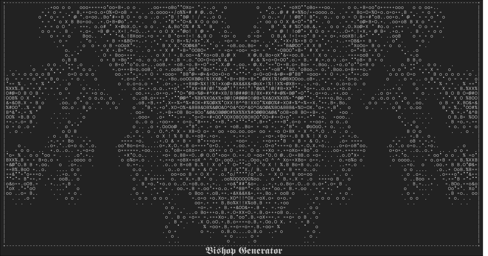
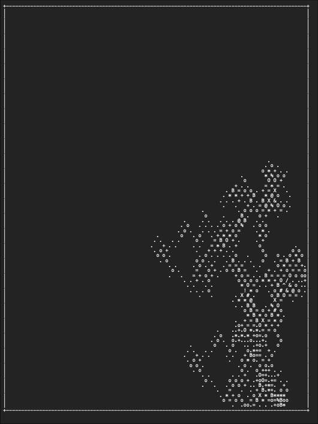
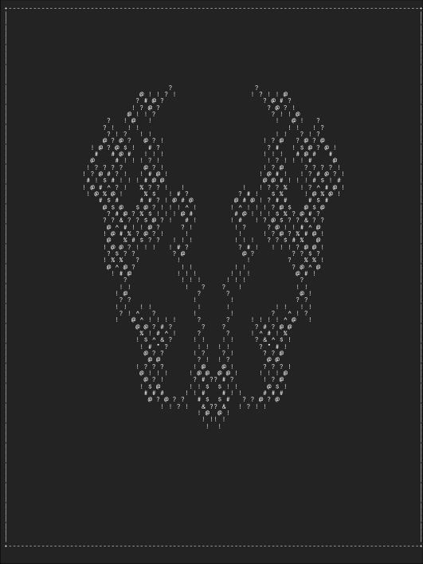

# Random ASCII Art Pattern Generator

## Description

This Python script generates random ASCII art patterns using multiple bishops with various customization options. It produces both text and PDF outputs with the ASCII patterns. This project was inspired by and includes modified code from Manfred Touron's "drunken-bishop" algorithm.

## Features

- Customizable number of bishops
- Optional use of different alphabets for different bishops
- Output in `.txt` and `.pdf` formats

## Dependencies

- `os`
- `random`
- `argparse`
- `unicodedata`
- `PIL`
- `pandas`
- `reportlab`

You can install the required third-party packages using pip:

```bash
pip install -r requirements.txt
```

## Usage

### Basic Usage

To run the script with default settings:

```bash
python drunken_bishop.py
```

## Example output

#### drunken:



#### sober:



### Advanced Usage

To customize the number of bishops, different alphabets, and other settings:

```bash
python drunken_bishop.py --min-bishops 4 --max-bishops 20 --different-alphabets --num-outputs 12 --rand-col --sober --landscape 
```

or use the **--I** flag for an Interactive version of this Script

### Help Menu

To view all the possible uses and flags:

```bash
python drunken_bishop.py -h
```

## Output

The script generates a text file and a PDF file in the `random_patterns` directory.

## Contributing

Feel free to fork the repository and submit pull requests. For any bugs or feature requests, please open an issue.

## License

This project incorporates elements of Manfred Touron's "drunken-bishop" algorithm (https://github.com/moul/drunken-bishop). This work is licensed under the MIT License. See the LICENSE file for more details.
